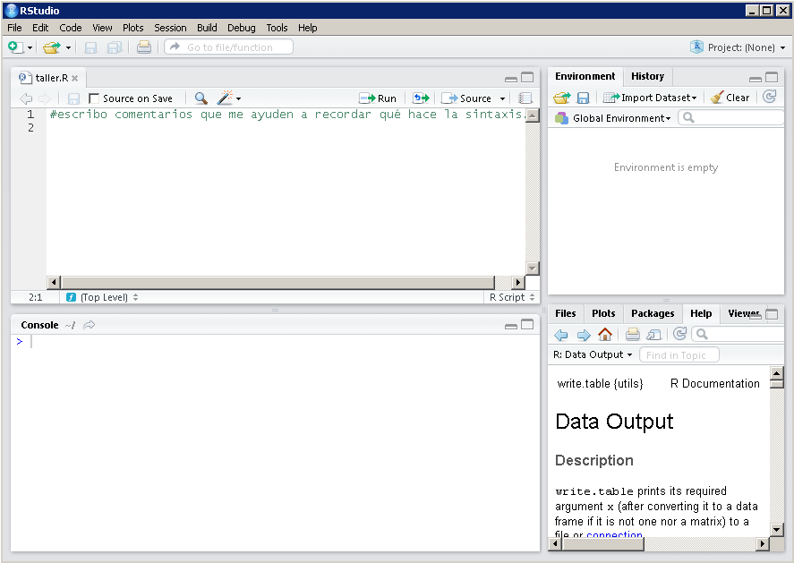
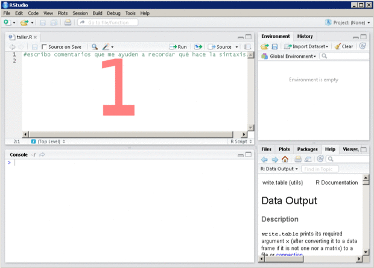
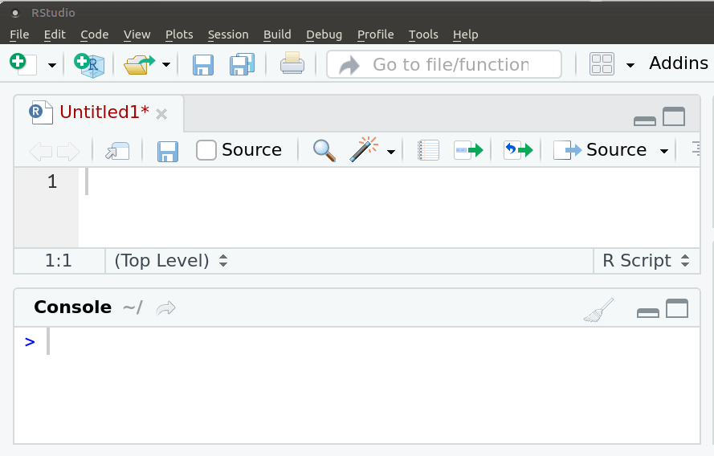
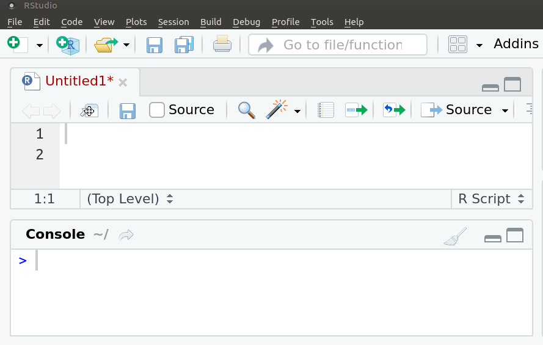

# Características del curso

```{r setup, include=FALSE}
options(htmltools.dir.version = FALSE)
knitr::opts_chunk$set(warning = FALSE, message = FALSE)
```
<br>
`r icon::fa("laptop-code", size=2)`  Espacio presencial: 16 horas de clases prácticas

<br>
<br>

`r icon::fa("link", size=2)` [Espacio virtual](https://webasignatura.ucu.edu.uy/course/view.php?id=8653)

<br>
<br>

`r icon::fa("file-alt", size=2)` Examen opcional

<br>
<br>

`r icon::fa("home", size=2)` Dedicación: durante el curso y después ... es la clave


<!-- - Todos los materiales del curso se pueden compartir y modificar para -->
<!-- futuros usos manteniendo su licencia CC-BY-SA  -->

---
# Curva de aprendizaje

Al inicio suele ser empinada

<iframe src="https://giphy.com/embed/xT5LMNsvvJzIB77S0g" width="680" height="366" frameBorder="0" class="giphy-embed" allowFullScreen></iframe><p><a href="https://giphy.com/gifs/season-9-the-simpsons-9x23-xT5LMNsvvJzIB77S0g"></a></p>

---
# ...

<iframe src="https://giphy.com/embed/3o6MbtpwBH9tlVMg2k" width="680" height="366" frameBorder="0" class="giphy-embed" allowFullScreen></iframe><p><a href="https://giphy.com/gifs/season-9-the-simpsons-9x23-3o6MbtpwBH9tlVMg2k"></a></p>

---
# Ayuda


<iframe src="https://giphy.com/embed/l2Jee8WOulPSBZwaI" width="680" height="366" frameBorder="0" class="giphy-embed" allowFullScreen></iframe><p><a href="https://giphy.com/gifs/season-9-the-simpsons-9x23-l2Jee8WOulPSBZwaI"></a></p>

---
# Objetivo

<!-- `r icon::fa("copy")` -->
<!-- `r icon::fa("paste")` -->
<!-- `r icon::fa("laptop-code")` -->
<!-- `r icon::fa("file-excel")` -->
<!-- `r icon::fa("folder-open")` -->
<!-- `r icon::fa("code")` -->
<!-- `r icon::fa("filter")` -->
<!-- `r icon::fa("sort-alpha-down")` -->
<!-- `r icon::fa("keyboard")` -->
<!-- `r icon::fa("terminal")` -->
<!-- `r icon::fa("linux")` -->
<!-- `r icon::fa("r-project")` -->
<!-- `r icon::fa("python")` -->
<!-- `r icon::fa_r_project(colour = "#384CB7")` -->

<!-- https://fontawesome.com/icons -->

Introducción al lenguaje R mediante RStudio

Manejar un gran conjunto de funciones 

Aprender R a través de la lógica tidyverse para lograr rápidamente:

--

Trabajar con datos reales e interesantes.

--

Crea visualizaciones atractivas e informativas.

--

Presentar los resultados de manera sencilla y potente.


---
# ¿Qué es `r icon::fa_r_project(colour = "#384CB7")`?

.left-column[

`r icon::fa("chart-area", size=3, color="#756bb1")` <br>

`r icon::fa("code", size=3, color="#2c7fb8")` <br>

`r icon::fa("creative-commons-nc", size=3, color="#636363")` <br> 

`r icon::fa("osi", size=3, color="#31a354")` <br>

`r icon::fa("github", size=3)` <br>

`r icon::fa("meetup", size=3, color="#de2d26")`
]

.rigth-column[

<br>

Programa estadístico: análisis
<br><br>

Lenguaje de programación: sintaxis
<br><br>

Software gratuito, se desacarga desde [CRAN](http://www.r-project.org).
<br><br>

Software libre: licencia [GNU](https://es.wikipedia.org/wiki/GNU_General_Public_License). Libertad de uso, modificación y  distribución.
<br><br>

Comunidad mundial: lo usa y mejora. Casi 20.000 paquetes en [CRAN]((https://cran.r-project.org/web/packages/)) y [github](https://github.com/)
<br><br>

Comunidad en Uruguay: [meetup R-Ladies](https://www.meetup.com/es-ES/rladies-montevideo/) y [meetup GURU](https://www.meetup.com/es-ES/GURU-mvd/)
]

---
# `r icon::fa("greater-than")` Terminal de R

- Luego del mensaje de apertura, el 'prompt' indica que R está listo. 


---
# ¿Cómo interactuamos con R?

- Las órdenes elementales de R consisten en expresiones o asignaciones. 
--

- Una **expresión**, se evalúa, se imprime el resultado y su valor se pierde. 
```{r message=FALSE, warning=FALSE, paged.print=FALSE}
2 + 3
```
--

- Una **asignación**, crea un objeto y no se imprime el resultado.
```{r }
x <- 2 + 3
```
--

- Una asignación se hace utilizando el símbolo: `r icon::fa("less-than")``r icon::fa("minus")`  o también con el símbolo  **=** 
<br>
--

- Otros programas estadísticos muestran directamente los resultados, R los guarda en un **'objeto'**. 
<br>
--

- Ejecuto el nombre del objeto para imprimir el resultado
```{r }
x 
```

---
# Calculadora


- R se puede usar como calculadora
--

- Además de los operadores aritméticos, trae funciones matemáticas

```{r}
# valor absoluto
abs(-1)
```
--

```{r}
# logaritmo
log(1)
```
--
```{r}
# exponencial
exp(0)
```
--
```{r}
# raíz cuadrada
sqrt(9)
```

<!-- - Logaritmo natural: log() -->
<!-- - Logaritmo: log(base=10) -->

---
# Funciones

- Una  función  es un  conjunto  de  **instrucciones**  que  operan  sobre unos **argumentos** y producen un **resultado**.
<br><br>
--

- Una función esconde líneas de código que permite reutilizarlo una y otra vez de manera sencilla.
<br><br>
--

- Las funciones tienen **nombres** descriptivos -en inglés- y se acompañan de **paréntesis curvos**.
<br><br>
--

- Por ejemplo, **sqrt** es la abreviación de square root
<br><br>
--

- Dentro de los paréntesis se definen los valores de sus argumentos.
<br><br>
--

- La mayoría tiene al menos un argumento obligatorio y el resto con valores por defecto.
<br><br>
--

- Se puede utilizar la ayuda de R para saber qué hace una función
```{r}
?sqrt 
help("sqrt")
```

---
# Operadores aritméticos

.pull-left[
`r icon::fa("plus")` &nbsp;&nbsp; Suma 
<br><br><br><br>

`r icon::fa("minus")` &nbsp;&nbsp; Resta 
<br><br><br><br><br>

`r icon::fa("asterisk")` &nbsp;&nbsp; Multiplicación 
<br><br><br><br><br>

** / ** &nbsp;&nbsp; División 

]
.pull-rigth[
```{r}
18 + sqrt(9)
```
<br>
```{r}
18 - sqrt(9)
```
<br>
```{r}
18 * sqrt(9)
```
<br>
```{r}
18 / sqrt(9)
```
]
<!-- - Exponente:  -->

---
# [RStudio](https://www.rstudio.com/)
<!-- (IDE -integrated development environment-)  entorno de desarrollo integrado -->



---
# Ventanas de RStudio

 

`r fontawesome::fa("link", fill = "purple")` [Cheatsheet](https://resources.rstudio.com/the-essentials-of-data-science/rstudio-ide)

---
# Bondades de RStudio

<!-- https://stackoverflow.com/questions/53549662/how-can-i-add-a-fontawesome-icon-to-a-table-in-rmarkdown -->
.left-column[

`r icon::fa("paint-brush", size=3, color="#dd1c77")`


`r icon::fa("git", color = "steelblue", size=3)`


]
.rigth-column[
<br>
Autocompleta y colorea código
<br><br><br>

Permite trabajar en proyecto (.Rproj) 
<br><br><br>

Permite conexión a git para control de versiones  
<br><br><br>

Creación de libros, webs, documentos 
]


---
# Ejecutar código

- Una sola línea: colocar el **cursor sobre esa línea** y ejecutar **Ctrl + ENTER**.



---
# Ejecutar código

- Varias líneas de código: **seleccionarlas todas** y ejecutar **Ctrl + ENTER**.


---
# Prompt  

- Si en vez de `r icon::fa("greater-than")` aparece el símbolo `r icon::fa("plus")`, hay una sentencia no finalizada.

<!-- - Mensajes de error **(Error)**: errores en la sintaxis (no ejecuta la/s líneas erroneas, pero si el resto) -->
--


---
# Objetos

- R es un programa **'orientado a objetos'**: variables, datos, funciones, resultados, etc., se guardan en la memoria RAM en forma de objetos con un nombre específico sin usar archivos temporales. 
<br>
--

- Cada clase de objeto tiene diferentes atributos que determinan la forma en que trabajan dentro de R. Cuáles funciones se le pueden aplicar. 
<br><br>
--

- Estos objetos se pueden modificar o manipular con **operadores** y **funciones** --que a su vez son objetos--. 
<br><br>
--

- Bajo este término se esconde la simplicidad y flexibilidad de R. 

---
# Clases de objetos

Algunas de las clases más comunes de objetos son: 'integer', 'numeric', 'character',
'logical' (son vectores), 'matrix', 'data.frame', 'list' y 'function'.


---
# Tipo de objetos

La cantidad de clases de objetos es muy grande y crece permanentemente a medida que se crean nuevos paquetes.

<!-- Casi en cada paquete existen funciones que devuelven objetos de clases únicas que sólo esa función puede -->
<!-- # generar y cuya interpretación y funcionalidad es específica del paquete en -->
<!-- # cuestión o de otros creados posteriormente y que dependen del mismo.  -->
<!-- Por ejemplo las clases "igraph" o "Spatial" de los paquetes igraph y sp definen  -->
<!-- # objetos asociados a trabajo con grafos y datos espaciales respectivamente. -->


| Objeto      | Dimensión           | Tipo de elementos | Ejemplo
|---------------|:-------------:|:------:|:------:|
| Vector    | length() | similares |`r icon::fa_ellipsis_v(colour="red", size=3)` |
| Matriz   | dim() | similares |   `r icon::fa_ellipsis_v(colour="red", size=3)``r icon::fa_ellipsis_v(colour="red", size=3)` |
| Marco de datos    | dim() | diferentes |`r icon::fa_ellipsis_v(colour="red", size=3)``r icon::fa_ellipsis_v(colour="blue", size=3)` `r icon::fa_ellipsis_v(colour="green", size=3)`|
| Lista   | length() | diferentes |`r icon::fa_circle(colour="red")` <br> `r icon::fa_circle(colour="blue")` <br> `r icon::fa_circle(colour="green")`| 

---
# c()

- Crea un vector
<br><br>
--

- Según sus elementos será la clase del vector: *character*, *numeric*, *integer*, *logical*, *complex* (1 + 7i)
<br><br>
--

- Cada elemento va separado por una coma
<br><br>
--

- Con la función **class()** compruebo que tipo de objeto es

---
# Vector

```{r}
x <- c(15, 16, 17, 19)
x
class(x)
```

```{r}
y <- x / 2
y
class(y) # numeric porque contiene decimales
```

La diferencia más importante entre ambos es que los primeros ocupan menos memoria (ver 'object.size').

```{r}
z <- complex(1)+x
z
class(z)
```

---
# Vector

Para el caso de "palabras" ("strings"), la clase "character" es la que utiliza R para manejar este tipo de objetos. Al igual que en la mayoría de los lenguajes de programación, R utiliza las comillas 
dobles " o simples ' para delimitar un string. 

<!-- # Nótese que al usar las comillas se puede incluir cualquier caracter dentro,  -->
<!-- # sin tener que preocuparse de que R lo interprete como un comando. Es decir,  -->
<!-- # se toma lo que está entre comillas de forma literal, razón por la cual  -->
<!-- # estos tipos de objetos son llamados "strings literals" muchas veces. -->

```{r}
w <- c("15", "16", "17", "19")
w
class(w)
```

```{r}
w <- c("lunes", "martes", "miércoles", "viernes")
w
class(w)
```

---
# ¿Por qué importa la clase de un objeto?

- La clase de un objeto afecta cómo las funciones trabajan con el mismo. 

- Por ejemplo, la función mean puede generar salidas coherentes con objetos numéricos o lógicos, pero no con caracteres. Lo mismo con la multiplicación:

```{r eval=FALSE}
mean(x)
w + 5
```

<!-- # Los objetos del tipo "logical" son resultado de operaciones lógicas, como  -->
<!-- # comparaciones (¿a es mayor que b?, ¿h es distinto de 3.1415?, etc). Por  -->
<!-- # ejemplo: -->
<!-- u <- 5 > 2:8 -->
<!-- u # [1]  TRUE  TRUE  TRUE FALSE FALSE FALSE FALSE -->
<!-- class(u) # "logical", es un vector con valores booleanos (ver lección relativa -->
<!--          # a operadores lógicos). -->
<!-- # Como verán la comparación aquí se hizo entre 5 y todos los elementos de 2:8 -->


<!-- mean(x) # [1] 3.1 -->
<!-- 2 * x # [1]  2.2  4.2  6.2  8.2 10.2 -->

<!-- mean(y) -->
<!-- #[1] NA -->
<!-- # Warning message: -->
<!-- # In mean.defaul( y) : argument is not numeric or logical: returning NA -->
<!-- 2 * y -->
<!-- # Error in 2 * y : non-numeric argument to binary operator -->
<!-- # Como y es "character", la función mean no pudo hacer un promedio, ni se -->
<!-- # pudo multiplicar por 2. -->

<!-- # Con los objetos lógicos sin embargo sí se pueden hacer operaciones -->
<!-- # matemáticas, ya que "TRUE" se considera igual a 1 y "FALSE" igual a 0: -->
<!-- 2 * u -->
<!-- # [1] 2 2 2 0 0 0 0 -->
<!-- sum(u) -->
<!-- # [1] 3 -->
<!-- mean(u) -->
<!-- # [1] 0.4285714 -->

---
# Data frame

- Puede verse como un conjunto de vectores de diferente tipo pero de igual dimensión.
<br>
--

- La Función data.frame() crea un marco de datos.
<br>
--

```{r}
df <- data.frame(x, w)
```
--

- En un conjunto de datos, cada variable es un vector. 
<br>
--

- En general el data.frame vendrá dado en un archivo.

---
# `r icon::fa("wikipedia-w")` Data


El conjunto de datos contiene información sobre los perfiles más visitados en la Wikipedia en español en enero 2019.

https://bit.ly/32hSqWK

---
# Directorio de trabajo

- Los archivos están en alguna carpeta de la computadora o irán a parar allí.
<br>
--

- R trabajo por defecto en cierta carpeta que se llama directorio de trabajo.
```{r}
getwd()
```
<br>
--

- Este se puede cambiar, indicando una nueva carpeta 
```{r eval=FALSE}
setwd("home/micompu/Desktop")
# chequeo el cambio
getwd()
```
<br>
--

- Pero no es recomendable que la correcta ejecución de la sintaxis dependa de una ruta específica...
<br>
--

- Más adelante veremos qué es trabajar en proyecto (rProj) para salvar este problema.

---
# Ruta de un archivo


En Mac: click derecho -> Obtener información -> Ubicación
---
# Importar archivo: read.csv()

```{r}
wiki <- read.csv("topviews-2019_01.csv")
# ver los primeros casos del objeto en la consola
head(wiki)

# ver el objeto en otra ventana
View(wiki)
```
```{r eval=FALSE}
# ver que contiene wiki directo en la consola
wiki
```

---
# Explorar los datos

```{r}
dim(wiki)
names(wiki)
```
```{r eval=FALSE}
# estructura de la base
str(wiki)
```

```{r}
# resumen descriptivo de variables
summary(wiki)
```

---
# Variables numéricas

```{r eval=FALSE}
# Suma
sum(wiki$Views)
```
```{r eval=FALSE}
# Máximo
max(wiki$Views)
```
```{r eval=FALSE}
# Mínimo
min(wiki$Views)
```
```{r eval=FALSE}
# Promedio
mean(wiki$Views)
```
```{r eval=FALSE}
# Mediana
median(wiki$Views)
```
```{r eval=FALSE}
# Varianza
var(wiki$Views)
```
```{r eval=FALSE}
# Desvío estándar
sd(wiki$Views)
```

---
# data$

Acceder a variables en un data frame: **data$variable**

<br><br>
<iframe src="https://giphy.com/embed/b55x0VFpFKm7S" width="480" height="333" frameBorder="0" class="giphy-embed" allowFullScreen></iframe><p><a href="https://giphy.com/gifs/lisa-simpson-writing-the-simpsons-b55x0VFpFKm7S"></a></p>


---
# Paquetes

- Por defecto vienen precargadas una serie de funciones que están en el paquete 'base'.
<br><br>
--

- Las funciones en R se organizan en paquetes según temas o disciplinas.
<br><br>
--

- Los paquetes debe instalarse en R una vez pero es necesario cargarlos en cada sesión (cada vez que abrimos R). 
<br><br>
--

- Hay millones de funciones si todas estuvieran precargadas, no habría suficiente memoria RAM para trabajar.
<br><br>
--

- Existen paquetes de tan variadas disciplinas que es muy probable que utilicemos relativamente pocos. 
<br><br>
--

- Podemos consultar los paquetes disponibles escribiendo la función available.packages() <br><br>
--

- También podemos generar nuestras propias funciones e incluso crear un paquete de R!

---
# tidyverse

.pull-left[

Conjunto de paquetes para:
<br><br>

Limpiar y transformar
<br><br>

Importar
<br><br>

Análisis
<br><br>

Visualización

 <!-- procesar, analizar y visualizar datos. -->
]
.pull-rigth[
```{r out.width = "300px" ,echo=FALSE}
knitr::include_graphics("img/tidyverse.png")
```
]

---
# Importación de archivos

.pull-left[

Leer y guardar archivos de texto plano (txt, csv, tsv)


<!-- {width=180px} -->
```{r out.width = "140px" ,fig.align="center", echo=FALSE}
knitr::include_graphics("img/readr.png")
```

Formatos propietarios (dta, sav)

```{r out.width = "140px" ,fig.align="center", echo=FALSE}
knitr::include_graphics("img/haven.png")
```

]
.pull-rigth[
<br>
Leer y guardar archivos Excel (xls)

```{r out.width = "140px" ,fig.align="center", echo=FALSE}
knitr::include_graphics("img/readxl.png")
```
<br>

Examinar y limpiar datos 

```{r out.width = "140px" ,fig.align="center", echo=FALSE}
knitr::include_graphics("img/janitor.png")
```

]


---
# Manipulación de datos

.pull-left[

Trasformar estructura de datos 

```{r out.width = "140px" ,fig.align="center", echo=FALSE}
knitr::include_graphics("img/tidyr.png")
```

Manipular texto

```{r out.width = "140px" ,fig.align="center", echo=FALSE}
knitr::include_graphics("img/stringr.png")
```

]
.pull-rigth[
<br>
Manipular fechas 

```{r out.width = "140px" ,fig.align="center", echo=FALSE}
knitr::include_graphics("img/lubridate.png")
```


Manipular datos 

```{r out.width = "140px" ,fig.align="center", echo=FALSE}
knitr::include_graphics("img/dplyr.png")
```

]

---
# Análisis y Visualización de datos

.pull-left[
Gráficos y mapas
<br>
<br>

```{r out.width = "250px", fig.align="center" ,echo=FALSE}
knitr::include_graphics("img/ggplot2.png")
```

]
.pull-rigth[
 Modelización
<br>
<br>
<br>

```{r out.width = "250px" ,fig.align="center", echo=FALSE}
knitr::include_graphics("img/broom.png")
```

]

---
# Paquetes: instalar y cargar


```{r eval=FALSE}
# instalar desde el CRAN
install.packages("readr")

# instalar desde github
# devtools::install_github("username/packagename")
devtools::install_github("tidyverse/readr")

# cargar
library(readr)
```

---
# readr::read_csv()

```{r}
library(readr)
wiki <- read_csv("topviews-2019_01.csv")
# ver el objeto en la consola
wiki
```

<!-- --- -->
<!-- # Variables categóricas -->

<!-- - table() -->

<!-- - mode() -->


<!-- https://www.kaggle.com/rodipardo/top-view-wikipedia-es-january-2019/downloads/top-view-wikipedia-es-january-2019.zip/1 -->

