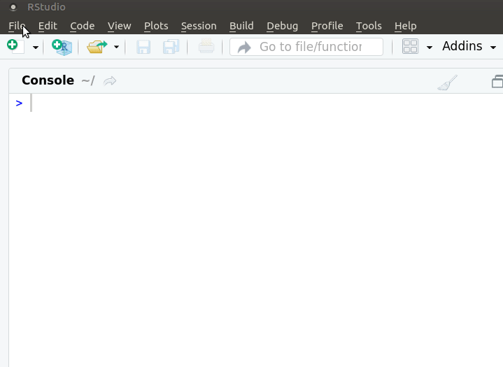
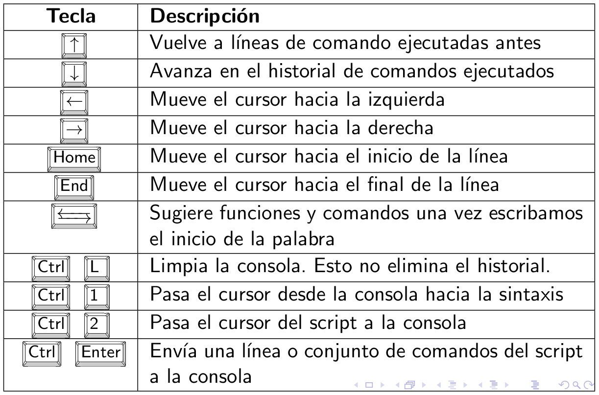

<!-- https://raw.githubusercontent.com/EvaMaeRey/flipbookr/master/inst/rmarkdown/templates/template-name/skeleton/skeleton.Rmd -->
<!-- https://github.com/mine-cetinkaya-rundel/teach-r-online/blob/master/01-cloud/01-cloud.Rmd -->
<!-- https://mine-cetinkaya-rundel.github.io/teach-r-online/01-cloud/01-cloud.html#13 -->
<!-- https://github.com/hadley/emo -->
<!-- https://arm.rbind.io/slides/xaringan.html#118 -->
<!-- https://arm.rbind.io/slides/xaringan.html#120 -->
```{r, include = F}
# This is the recommended set up for flipbooks
# you might think about setting cache to TRUE as you gain practice --- building flipbooks from scratch can be time consuming
knitr::opts_chunk$set(fig.width = 6, message = FALSE, warning = FALSE, comment = "", cache = FALSE, fig.retina = 3)
library(flipbookr)
library(tidyverse)
library(flair)
library(kableExtra)
```
```{r xaringan-themer, include=FALSE, warning=FALSE}
library(xaringanthemer)
style_duo_accent(
  #base_color = "#43a2ca",
  header_font_google = google_font("Mukta"),#Ubuntu Condensed
  text_font_google   = google_font("Montserrat", "300", "300i"),
  code_font_google   = google_font("Fira Mono"),
  primary_color      = "#0F4C81", # pantone classic blue
  secondary_color    = "#b3e2cd", # pantone baby blue
  #header_font_google = google_font("Raleway"),
  #text_font_google   = google_font("Raleway", "300", "300i"),
  #code_font_google   = google_font("Source Code Pro"),
  text_font_size     = "25px"
#   colors = c(
#   red = "#f34213",
#   purple = "#3e2f5b",
#   orange = "#ff8811",
#   green = "#136f63",
#   white = "#FFFFFF",
# )
)

```

```{r, include=FALSE}
text_spec2 <- function(x = "x"){
  text_spec(x, background = "#b3e2cd", bold = T)
}
```

class: hide-logo
# Características del curso

<!-- use the trailing comment #<< to highlight specific lines of the code -->
<!-- https://zhiiiyang.github.io/XaringanTutorial/#35 -->
<!-- https://zhiiiyang.github.io/XaringanTutorial/#47 -->
```{r setup, include=FALSE}
options(htmltools.dir.version = FALSE)
knitr::opts_chunk$set(warning = FALSE, message = FALSE)
```


.left-column[
`r icon::fa("laptop-code", size=2, color = "#43a2ca")` 
<br>

`r icon::fa("link", size=2, color = "#43a2ca")` 
<br>

`r icon::fa("question", size=2, color = "#43a2ca")` 
<br>

`r icon::fa("file-alt", size=2, color = "#43a2ca")` 
<br>

`r icon::fa("home", size=2, color = "#43a2ca")` 
<br>

`r icon::fa("comments", size=2, color = "#43a2ca")` 
]
.right-column[
Espacio "presencial": `r text_spec2("16 horas")` de clases teóricas/prácticas
<br>

<a href="https://webasignatura.ucu.edu.uy/course/view.php?id=6789">Espacio virtual</a>
<br>

Participar durante la clase a través del `r text_spec2("chat")` de zoom o `r text_spec2("pedir la palabra")`.
<br><br>

`r text_spec2("Examen")` opcional
<br><br>

`r text_spec2("Dedicación:")` durante el curso y después ... es la .red[clave]
<br>

Comunicación: `r text_spec2("foro y mail")`
]

<!-- --- -->
<!-- # Talleres  -->


<!-- - `r icon::fa("microphone", size=1, color = "#43a2ca")`  micrófono apagado. -->
<!-- -- -->

<!-- - `r icon::fa("question", size=1, color = "#43a2ca")`  Escribir por chat o pedir la palabra  -->
<!-- -- -->

<!-- -  Es importante que participen, pregunten y respondan. No hay preguntas tontas! -->

<!-- -  Se agradece usen su nombre y apellido y una foto de perfil -->
<!-- -- -->

<!-- -  `r icon::fa("users", size=1, color = "#43a2ca")`  Serán organizados en grupos aleatorios durante los ejercicios de modo que puedan ayudarse entre ustedes. -->
<!-- -- -->

<!-- -  `r icon::fa("video", size=1, color = "#43a2ca")` Cada taller será grabado y se publicará el video posteriormente. -->


<!-- - Todos los materiales del curso se pueden compartir y modificar para -->
<!-- futuros usos manteniendo su licencia CC-BY-SA  -->


---
class: hide-logo
# ¿Qué haremos hoy?

- `r text_spec2("¿Qué es R?")`
<br>
--

- Usar R como  `r text_spec2("calculadora")`
<br>
--

- Conceptos básicos: `r text_spec2("objetos y clase de objetos")`
<br><br>
--

-  `r text_spec2("Vectores")`: numéricos, lógicos y de caracteres
<br>
--

-  `r text_spec2("Funciones")` y `r text_spec2("operadores")`
<br>
--

- Marco de datos (`r text_spec2("data frame")`)
<br><br>
--

- `r text_spec2("Importar")` un archivo csv
<br>
--

-  `r text_spec2("Explorar")` un conjunto de datos (data frame)
<br><br>
--

- Extensiones a R base: `r text_spec2("paquetes")`
<br>
--

- Paquete `r text_spec2("tidyverse")`
<br><br>
--

- ¿Qué es un `r text_spec2("script")`?
<br>
--

- Alternaremos entre `r text_spec2("ejemplos")` y `r text_spec2("ejercicios")`

---
class: hide-logo
# ¿Qué es `r icon::fa_r_project(colour = "#384CB7")`?

.left-column[

`r icon::fa("chart-area", size=2, color="#756bb1")` <br>

`r icon::fa("code", size=2, color="#2c7fb8")` <br>

`r icon::fa("creative-commons-nc", size=2, color="#636363")` <br> 

`r icon::fa("osi", size=2, color="#31a354")` <br>

`r icon::fa("github", size=2)` <br>

`r icon::fa("meetup", size=2, color="#de2d26")`
]

.rigth-column[

`r text_spec2("Programa estadístico")`: análisis
<br><br>

`r text_spec2("Lenguaje")` de programación: sintaxis
<br><br>

Software `r text_spec2("gratuito")`, se desacarga desde [CRAN](http://www.r-project.org).
<br><br>

Software `r text_spec2("libre")`: licencia [GNU](https://es.wikipedia.org/wiki/GNU_General_Public_License). Libertad de uso, modificación y  distribución.
<br>

`r text_spec2("Comunidad")` mundial: lo usa y mejora. Casi 20.000 paquetes en [CRAN]((https://cran.r-project.org/web/packages/)) y [github](https://github.com/)
<br>

Comunidad en Uruguay: [meetup R-Ladies](https://www.meetup.com/es-ES/rladies-montevideo/) y [meetup GURU](https://www.meetup.com/es-ES/GURU-mvd/)
]

---
# ¿Quiénes usan/usamos R?

<!-- [Visualizador](https://benubah.github.io/r-community-explorer/rugs-cluster-map.html) RUGs y R-Ladies -->

<iframe src="https://benubah.github.io/r-community-explorer/rugs-cluster-map.html"  width="1200" height="520" frameBorder="0"></iframe>

<!-- https://rpubs.com/anish20/StackOverflowDeveloperSurveyAnalysis -->

---
class: inverse, center, middle
# Intro R
<!--  -->

<!-- .left[words] -->
---
class: hide-logo 
# Curva de aprendizaje

Al inicio suele ser empinada
<center>

</center>
<!--  -->

---
class: hide-logo
# ...

<center>

</center>

---
class: hide-logo
# Ayuda

El curso busca guiarlos por un camino menos empinado

<center>

</center>

<!-- Introducción al lenguaje R mediante RStudio -->

<!-- Manejar un gran conjunto de funciones  -->

<!-- Aprender R a través de la lógica tidyverse para lograr rápidamente: -->

<!-- -- -->

<!-- Trabajar con datos reales e interesantes. -->

<!-- -- -->

<!-- Crea visualizaciones atractivas e informativas. -->

<!-- -- -->

<!-- Presentar los resultados de manera sencilla y potente. -->


---
class: hide-logo
# `r icon::fa("greater-than")` Abrimos RStudio


---
class: hide-logo
# ¿Cómo interactuamos con R?

.pull-left[
- Al abrir RStudio vemos el panel llamado "Console" que es la `r text_spec2("consola")` de R.

- R inicia con un `r text_spec2("mensaje")` de apertura que indica entre otras cosas, la versión.

]

.pull-right[
- Luego del mensaje de apertura, el 'prompt', `r text_spec2(">")`, indica que R está listo. 


<!--  -->
]
---
class: hide-logo
# ¿Cómo interactuamos con R?

- Es un lenguaje de programación: escribimos `r text_spec2("código")` en la consola para darle órdenes a R.

- Las `r text_spec2("órdenes")` elementales de R consisten en expresiones o asignaciones. 
--

- Una `r text_spec2("expresión")`, se evalúa, se imprime el resultado y su valor se pierde. 
```{r message=FALSE, warning=FALSE, paged.print=FALSE}
2 + 3  #<<
```
--

---
class: hide-logo
# ¿Cómo interactuamos con R?


- Una `r text_spec2("asignación")`, crea un objeto y no se imprime el resultado.
```{r flecha, include = FALSE}

x <- 2 + 3
```

```{r, echo = FALSE}

decorate("flecha") %>% 
  flair("<-")
  
```

--

- Una asignación se hace utilizando el símbolo: `r icon::fa("less-than")``r icon::fa("minus")` 
<br>
--

- Otros programas estadísticos muestran directamente los resultados, R los guarda en un `r text_spec2("objeto")`. 
<br>
--

- Ejecuto el nombre del objeto para imprimir/mostrar el resultado
```{r }
x 
```

---
class: hide-logo
# Operadores aritméticos
.pull-left[

- `r text_spec2("Suma")`

```{r sum, include = FALSE}
18 + 9
```

```{r, echo = FALSE}
decorate("sum") %>% 
  flair("+")
```


- `r text_spec2("Resta")`
```{r minus, include = FALSE}
18 - 9
```

```{r, echo = FALSE}
decorate("minus") %>% 
  flair("-")
```


]
.pull-right[

- `r text_spec2("Multiplicación")`

```{r por, include = FALSE}
18 * 9
```

```{r, echo = FALSE}
decorate("por") %>% 
  flair("*")
```

- `r text_spec2("División")`
```{r divido, include = FALSE}
18 / 9
```

```{r, echo = FALSE}
decorate("divido") %>% 
  flair("/")
```
]

---
class: hide-logo
# Ejercicio (3')

.pull-left[

- ¿Cuánto gasté en el super? 

- ¿Cuánto gasté en pesos uruguayos?

- Escribe la cuenta en la consola de R
]
<!--  -->

.pull-right[
```{r echo=FALSE, out.width="50%"}
knitr::include_graphics("img/ticket.png")
```
<!--  -->

]

---
class: hide-logo
# Calculadora

- Además de los operadores aritméticos, trae `r text_spec2("funciones matemáticas")`

```{r}
# valor absoluto
abs(-1)
```
--

--
```{r}
# exponencial
exp(0)
```
--
```{r}
# raíz cuadrada
sqrt(9)
```

---
class: hide-logo
# Funciones

- Una  función  es un  conjunto  de  `r text_spec2("instrucciones")` que  operan  sobre unos `r text_spec2("argumentos")` y producen un `r text_spec2("resultado")`.
<br><br>
--

- Una función esconde líneas de código que permite reutilizarlo una y otra vez.
<br><br>
--

- Las funciones tienen `r text_spec2("nombres")` descriptivos -en inglés- y se acompañan de `r text_spec2("paréntesis curvos")`. Por ejemplo, `r text_spec2("sqrt()")` es la abreviación de square root (raíz cuadrada)
<br><br>
--

- Dentro de los paréntesis se definen los valores de sus argumentos:  `r text_spec2("sqrt(9)")`
<br><br>
--

- La mayoría tiene al menos un argumento obligatorio y el resto con valores por defecto. Usa la `r text_spec2("ayuda")` de R para saber qué hace una función:

```{r}
?sqrt 
help("sqrt")
```

---
class: inverse, center, middle
# RStudio

---
class: hide-logo
# [RStudio](https://www.rstudio.com/)
<!-- (IDE -integrated development environment-)  entorno de desarrollo integrado -->


---
class: hide-logo
# Ventanas de RStudio

<!--   -->

```{r out.width="120%", echo=FALSE}
knitr::include_graphics("img/panels2.png")
```

`r fontawesome::fa("link", fill = "#43a2ca")` [Cheatsheet](https://resources.rstudio.com/the-essentials-of-data-science/rstudio-ide)


<!-- https://github.com/rstudio/hex-stickers/tree/master/PNG -->
<!-- https://stackoverflow.com/questions/53549662/how-can-i-add-a-fontawesome-icon-to-a-table-in-rmarkdown -->
---
# Script



---
# Script

- Un archivo donde se `r text_spec2("escribe")` la sintaxis (el código) y luego se `r text_spec2("envía")` a la consola.
<br><br>
--

- Un script permite `r text_spec2("reproducir")` nuestro análisis o que otra persona lo haga.
<br><br>
--

- Tendrá una extensión `r text_spec2(".R")` y al hacer doble click sobre el archivo se abre RStudio.
<br><br>
--

- Es clave `r text_spec2("comentar")` el código, los comentarios deben ir precedidos por `r text_spec2("#")`.
<br><br>
--

- Los comentarios se verán de un color diferente al código, incluso cuando se comenta parte de un código.
<br><br>
--

- Un comentario se envía a la consola pero `r text_spec2("no se ejecuta")` nada. 

---
# Autocompleta código

La ventana de script  `r text_spec2("colorea y autocompleta")` código. Muestra el  `r text_spec2("help")`  de la función.


---
# Comentarios


<!-- --- -->
<!-- # Proyecto  -->

<!-- Permite trabajar en proyecto (.Rproj)  -->

<!--  -->


<!-- --- -->
<!-- # git -->

<!-- Permite conexión a git para control de versiones   -->
<!-- <br><br><br> -->

<!-- --- -->
<!-- # Web, documentos, libros, aplicaciones -->

<!-- Creación de libros, webs, documentos, visualizadores, etc.  -->

<!-- ```{r out.width = "60px" ,echo=FALSE} -->
<!-- knitr::include_graphics("https://raw.githubusercontent.com/rstudio/hex-stickers/master/PNG/shiny.png") -->
<!-- knitr::include_graphics("https://raw.githubusercontent.com/rstudio/hex-stickers/master/PNG/knitr.png") -->
<!-- knitr::include_graphics("https://raw.githubusercontent.com/rstudio/hex-stickers/master/PNG/rmarkdown.png") -->
<!-- knitr::include_graphics("https://raw.githubusercontent.com/rstudio/hex-stickers/master/PNG/plumber-female.png") -->
<!-- knitr::include_graphics("https://raw.githubusercontent.com/rstudio/hex-stickers/master/PNG/blogdown.png") -->
<!-- knitr::include_graphics("https://raw.githubusercontent.com/rstudio/hex-stickers/master/PNG/bookdown.png") -->
<!-- knitr::include_graphics("https://raw.githubusercontent.com/rstudio/hex-stickers/master/PNG/flexdashboard.png") -->
<!-- ``` -->

---
class: hide-logo
# Ejecutar código

- Una sola línea: colocar el  `r text_spec2("cursor sobre esa línea")` y ejecutar  `r text_spec2("Ctrl + ENTER")`.


---
class: hide-logo
# Ejecutar código

- Varias líneas de código:  `r text_spec2("seleccionarlas todas")` y ejecutar  `r text_spec2("Ctrl + ENTER")`.


---
# Atajos de teclado

<center>

</center>

<!-- stack-overflow -->


<!-- file.copy(from=origen, to=destino) -->
<!-- file.remove(origen) -->

<!-- unzip(destname, exdir=destino, junkpaths=TRUE) -->


<!-- if (dim(e)==2){ -->
<!--   stop("es necesario agregar errores nuevos al objeto errores_EP") -->
<!-- } -->

---
class: hide-logo
# Flecha: atajo de teclado en Linux/Windows
(teclado en español)


---
class: hide-logo
# Flecha: atajo de teclado en Mac 
(teclado en español)


---
# Atajos de teclado

```{r, out.height="100%", echo=FALSE, fig.align='center'}

```

<!--  -->
